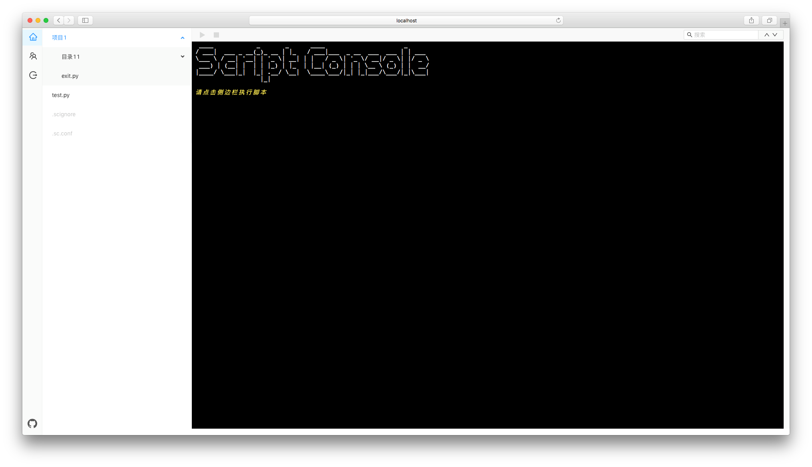

# script-console

_Web Terminal_

## 安装

### docker

```shell
git clone https://github.com/Dog-Egg/script-console.git

cd script-console

docker build -t script-console .

docker run --rm -v /xxx/scripts:/scripts -v /xxx/data:/data -P -d script-console
```

## 截图


