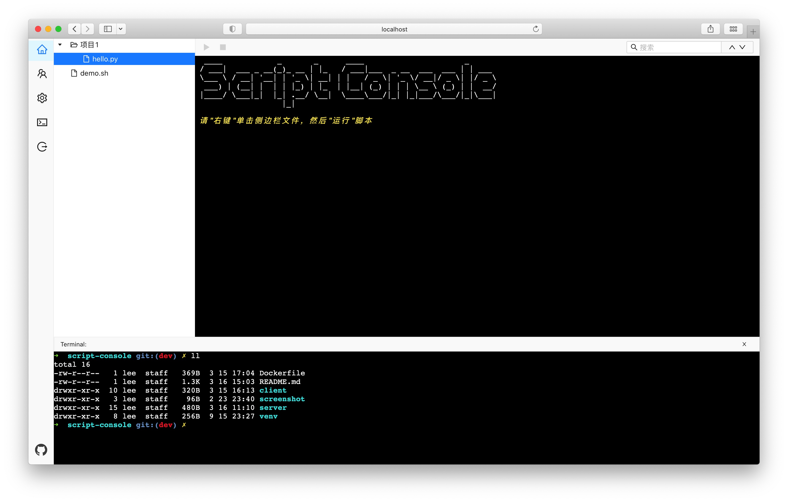

# script-console

提供在 Web 端管理、编辑和运行脚本文件

## 安装

### Docker

```shell
git clone https://github.com/Dog-Egg/script-console.git

cd script-console

docker build -t script-console .

docker run --rm -v /xxx/scripts:/scripts -v /xxx/data:/data -p 8310:8310 -d script-console
```

或者使用已构建的镜像

```shell
docker pull dogegg/script-console:latest
```

## .sc-conf.yaml

脚本配置文件

```yaml
commands:
  - pattern: \.py$    # [必填] 正则表达式，匹配 .py 结尾的文件
    program: python   # [必填] 使用 python 来执行文件
    environment: # 环境变量
      PYTHONPATH: /xxx/site-packages
access:
  - pattern: adminGroup   # [必填] 正则表达式
    groups: # 用户组访问权限
      - admin
```

## 用户系统

- 不登录会以匿名用户的形式展示；
- 系统特定的 admin 为管理员组，其它组可以随意自定义组名；
- 程序启动时会在运行日志打印一个的 admin token，用以首次启动系统时使用。

## Building & Running
```
node >= 12
python >= 3.6
```

## Testing

```shell
# server
cd server
python -m unittest tests/test_*
```

## Nginx Proxy

```
# example

server {
    listen      80;
    server_name www.example.com;

    allow 10.0.16.1;
    deny all;

    location / {
        proxy_pass http://127.0.0.1:8310;
    }
    location /ws {
        proxy_pass http://127.0.0.1:8310;
        proxy_set_header Origin http://127.0.0.1:8310;
        proxy_http_version 1.1;
        proxy_set_header Upgrade $http_upgrade;
        proxy_set_header Connection "upgrade";
    }
}
```

## 截图



## TODO List

- [x] 终端控制台
- [ ] 支持飞书、钉钉登录
